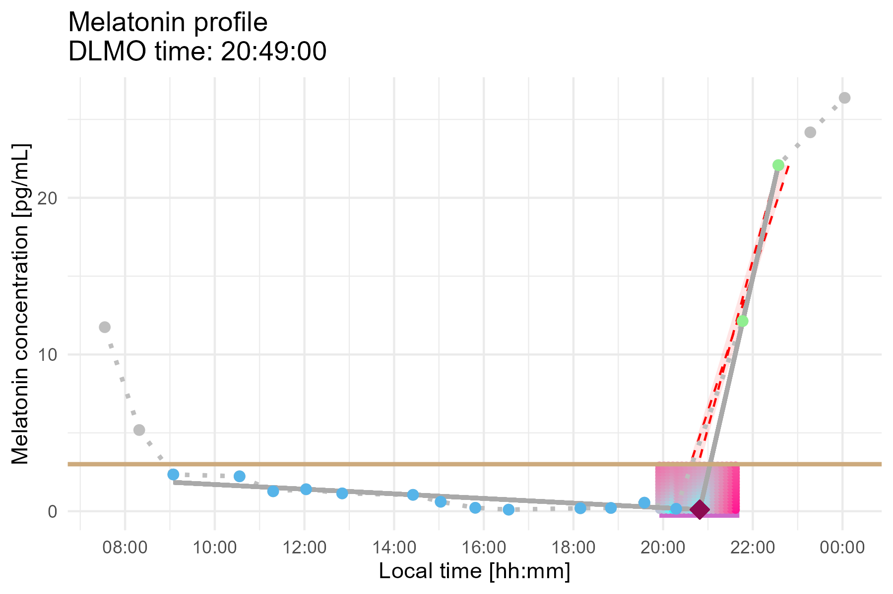
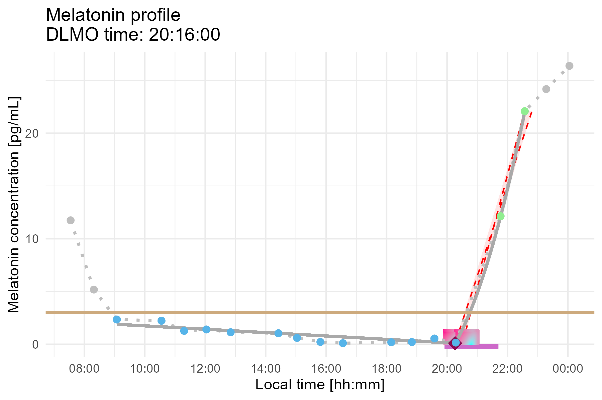

dlmoR: Dim-Light Melatonin Onset Estimation
================

<!-- README.md is generated from README.Rmd. Please edit that file -->

## **`dlmoR`**

**`dlmoR`** is an R package that implements the hockey-stick method
[(Danilenko et al., 2014)](https://doi.org/10.3109/07420528.2013.855226)
for estimating dim light melatonin onset (DLMO) — a key circadian phase
marker in chronobiology and sleep research.

The hockey-stick algorithm models melatonin rise as a piecewise
linear-parabolic curve, with the DLMO time point determined as the
inflection point of the piecewise curve that best fits the melatonin
profile, in a least-squares sense. This approach provides a more
objective and robust estimate of DLMO compared to traditional
threshold-based methods, which can be limited by variability in baseline
melatonin levels and subjectivity in visual estimation ([Benloucif et
al., 2008](https://doi.org/10.5664/jcsm.27083); [Kennaway,
2023](https://doi.org/10.1093/sleep/zsad033); [Glacet et al.,
2023](https://doi.org/10.1080/07420528.2022.2150554)).

A Windows-based executable of this algorithm was previously released
([Danilenko & Verevkin,
2020](https://www.researchgate.net/publication/349443463_Download_Hockey-stick_v25_software)),
but its closed-source format limits flexibility. The original software
does not allow modification or inspection of the underlying algorithm,
lacks an API for integration into analytical workflows, and requires
manual operation, making batch processing inefficient.

By bringing this method into the R-programming environment, **`dlmoR`**
provides an open-source, transparent, and scriptable alternative. It
enables reproducible and batchable DLMO estimation, allowing users to
efficiently analyze multiple melatonin time-series within
high-throughput workflows.

## Installation

You can install the latest development version of **`dlmoR`** from
[GitHub](https://github.com/) with:

``` r
# install.packages("pak")
pak::pak("tscnlab/dlmoR")
```

## Example

This is a simple example that illustrates how to use **`dlmoR`**:

``` r
# Load the package
library(dlmoR)

# Load sample data (provided with the package)
filename <- system.file("extdata/sample_melatonin_profile.csv", package = "dlmoR")

# Compute DLMO with a threshold of 3 pg/mL
dlmo_result <- calculate_dlmo(file_path = filename, threshold = 3, fine_flag = TRUE)

# View estimated DLMO inflection point (decimal-hours) and melatonin concentration (pg/mL) at this time
dlmo_result$ip$inflection_point
#        x     y
36   20.26667 0.1

# View estimated DLMO timestamp
dlmo$time
20:16:00

# View estimated melatonin concentration at DLMO time
dlmo$fit_melatonin
0.1

# View parameters of fit lines 
# Baseline fit type is always linear: slope m, y-intercept b
$fit_lines$base$type
[1] "linear"

$fit_lines$base$m
[1] -0.1599731

$fit_lines$base$b
[1] 3.342121

# Ascending fit type is either linear or parabolic.
$fit_lines$ascending$type
[1] "parabolic"

$fit_lines$ascending$a
1.918017 

$fit_lines$ascending$b
-72.59794 

$fit_lines$ascending$c
683.6161 

# Plot the melatonin profile with DLMO detection
print(dlmo_result$dlmoplotcoarse)
print(dlmo_result$dlmoplotfine)
```

**Dim-Light Melatonin Onset (DLMO) Plot (coarse grid search view)**  


**Dim-Light Melatonin Onset (reduced fine grid search view)**  


## **Expected Runtime**

The runtime of `calculate_dlmo()` depends on the selected search method:

- **Coarse- and fine-grid DLMO search (`fine_flag = TRUE`, default)**:
  ~10 minutes per melatonin profile.  
- **Coarse-grid DLMO search only (`fine_flag = FALSE`)**: ~1 minute per
  melatonin profile.

For **batch processing**, runtime scales approximately linearly with the
number of profiles analyzed.

## **Citing `dlmoR`**

If you use `dlmoR` in your research, please cite the following preprint,
which describes the package and its implementation:

Thalji, S. M., & Spitschan, M. (2025). *dlmoR: An open-source R package
for the dim-light melatonin onset (DLMO) hockey-stick method.* [bioRxiv,
2025-01](https://doi.org/10.1101/2025.01.13.632603).
